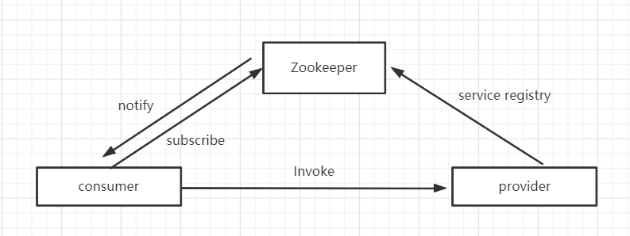

# Trpc project

A rpc framework based on Netty.

## Architecture



## Contributing

Any contribution is welcome!


## 环境
JDK8+,Zookeeper3.6

## 功能

* ZK注册中心
* 负载均衡
* 路由支持
* 自动发现
* 自定义RPC协议
* 泛化调用
* 支持接口多版本

泛化调用

泛化调用实现方式有俩种：

1.客户端框架编译出要调用的类，获取Class然后传到服务端

2.客户端只是带上String类型的类名、参数类型到服务端，服务端再通过ClassLoader进行load，然后进行反射调用

如何使用：
```bash
public interface IPersonService {

    List<Person> callPerson(String name, Integer num);


    Set<Person> getPersonSet(HashMap<String,Integer> map,LinkedList<String> names);
}
```

```bash
    private TrpcClient trpcClient;

    @Before
    public void before() {
        trpcClient = new TrpcClient(getRegistryAddress());
    }
    
    //泛化调用
    @Test
    public void test_generic() throws InterruptedException {
        GenericReference genericReference = new GenericReference();
        genericReference.setTrpcClient(trpcClient);
        genericReference.setInterfaceName("com.netty.trpc.test.api.IPersonService");
        genericReference.setVersion("1.2");
        genericReference.setMethodName("callPerson");
        String[] parameterTypes = {"java.lang.String", "java.lang.Integer"};
        genericReference.setParameterTypes(parameterTypes);

        GenericConfig genericConfig = genericReference.get();
        Object[] args = {"Jack", 3};
        for (int i = 0; i < 10; i++) {
            Object result = genericConfig.$invoke(args);
            LOGGER.info("result:{}",result.toString());
        }
    }

    @Test
    public void test_genericComplicatedParameters(){
        GenericReference genericReference = new GenericReference();
        genericReference.setTrpcClient(trpcClient);
        genericReference.setInterfaceName("com.netty.trpc.test.api.IPersonService");
        genericReference.setVersion("1.2");
        genericReference.setMethodName("getPersonSet");
        String[] parameterTypes = {"java.util.HashMap", "java.util.LinkedList"};
        genericReference.setParameterTypes(parameterTypes);

        GenericConfig genericConfig = genericReference.get();
        List<String> list=new LinkedList<>();
        list.add("name1");
        list.add("name2");
        list.add("name3");
        HashMap<String,Integer> map=new HashMap<>();
        map.put("name1",5);
        map.put("name2",6);
        map.put("name3",7);

        Object[] args = {map, list};
        for (int i = 0; i < 10; i++) {
            Object result = genericConfig.$invoke(args);
            LOGGER.info("result:{}",result.toString());
        }
    }
```